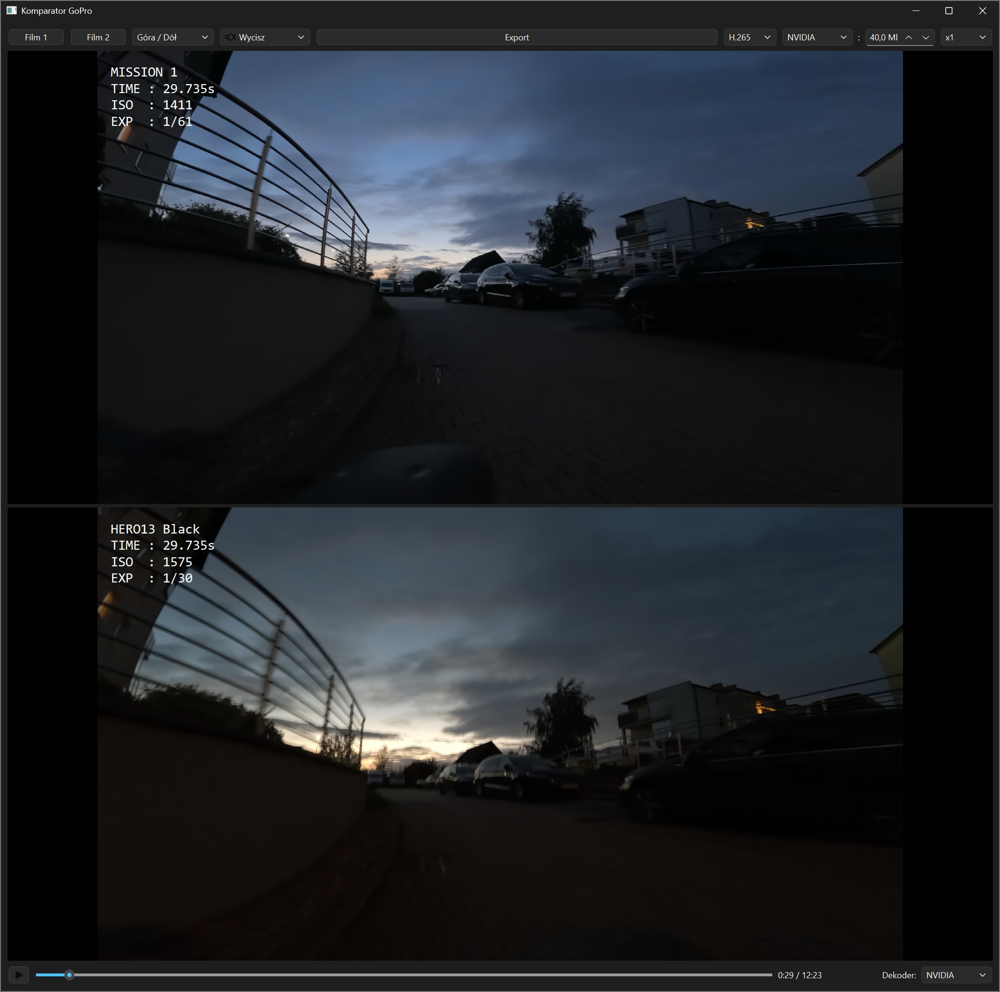
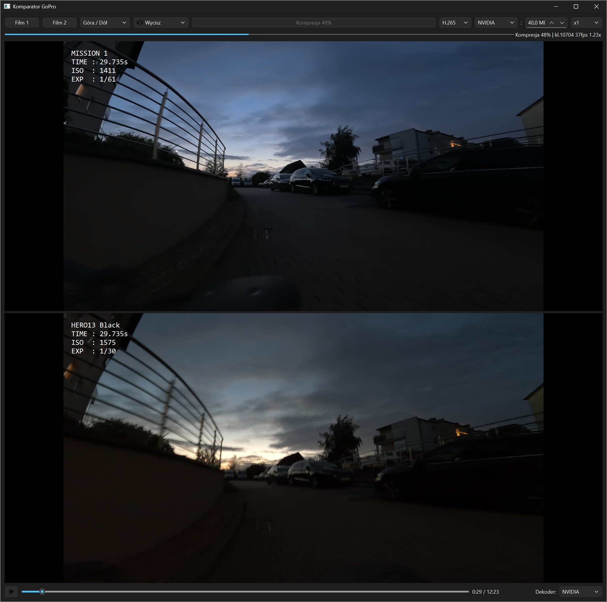

# Komparator Wideo

Komparator to zaawansowane narzędzie do odtwarzania, synchronizacji i porównywania dwóch plików wideo (np. z kamer sportowych takich jak GoPro), wyposażone w nakładkę telemetryczną GPMF. Aplikacja wykorzystuje sprzętową akcelerację GPU (NVENC/QSV/AMF) dla zapewnienia płynnego odtwarzania filmów 4K HEVC z mechanizmem Zero-Copy.

## Zrzuty ekranu



## Główne funkcje
- **Podgląd side-by-side oraz top/bottom**: Płynne przełączanie między układami widoku.
- **Automatyczna synchronizacja audio (AutoSync)**: Precyzyjne dopasowanie czasowe nagrań oparte na korelacji obwiedni energii dźwięku (z automatyczną filtracją szumu wiatru powyżej 500 Hz).
- **Odczyt telemetrii (GPMF)**: Wyświetlanie nakładki telemetrycznej z parametrami kamery (data/czas, ISO, czas naświetlania itp.) z automatyczną konwersją czasu do strefy czasowej systemu użytkownika.
- **Przełącznik nakładki**: Możliwość wyłączenia renderowania parametrów na podglądzie w locie oraz przy eksporcie.
- **Sprzętowa Akceleracja**: Renderowanie interfejsu (Qt/OpenGL/Direct3D) z pełną obsługą odciążenia dekodowania wideo (H.264/H.265).
- **Stabilna synchronizacja (Master-Slave)**: Jednokierunkowy mechanizm synchronizacji czasowej (Film 1 steruje Filmem 2), eliminujący pętle sprzężenia zwrotnego i chroniący przed zacięciami/stutteringiem.
- **Informacyjny Eksport FFmpeg**: Zrzucanie zsynchronizowanego widoku na dysk z bezpośrednim wypalaniem napisów lub bez. Postęp (w tym klatki, FPS i szacowany czas do końca ETA) wyświetlany jest bezpośrednio na przycisku Eksportu.
- **Automatyczna lokalizacja (PL/EN)**: Automatyczne dostosowanie języka interfejsu na podstawie języka systemu operacyjnego.

## Wymagania systemowe
* System operacyjny: Windows 10/11
* Karta graficzna wspierająca sprzętowe dekodowanie/kodowanie H.265 (NVIDIA, Intel lub AMD).
* Python 3.10+
* **FFmpeg**: Narzędzia `ffmpeg` oraz `ffprobe` muszą być zainstalowane i dostępne w systemowej zmiennej `PATH`.

## Instalacja

1. Sklonuj repozytorium:
   ```bash
   git clone <url_repozytorium>
   cd Komparator
   ```

2. Zainstaluj wymagane zależności:
   ```bash
   pip install -r requirements.txt
   ```

## Uruchamianie

Aby uruchomić aplikację w trybie deweloperskim, użyj:
```bash
python src/main.py
```

## Kompilacja do pliku `.exe`

Dla łatwiejszej dystrybucji, możesz skompilować aplikację do jednego, niezależnego pliku binarnego używając programu PyInstaller.
W Releases jest też wersja już skompilowana gotowa do uruchomienia

Aby skompilować aplikację na systemie Windows, wpisz w terminalu:
```bash
pyinstaller main.spec
```
Gotowy plik `main.exe` pojawi się w folderze `dist/`.

## Technologie i Zależności
- [PySide6](https://pypi.org/project/PySide6/) (GUI oraz mechanizm QtMultimedia)
- [numpy](https://pypi.org/project/numpy/) / [scipy](https://pypi.org/project/scipy/) (analiza audio i detekcja przesunięcia)
- FFmpeg (do eksportowania połączonych strumieni)

Jeżeli podoba ci się ten program możesz kupić mi kawe
[W Releases jest też wersja już skompilowana gotowa do uruchomienia](https://buycoffee.to/malcerz)
